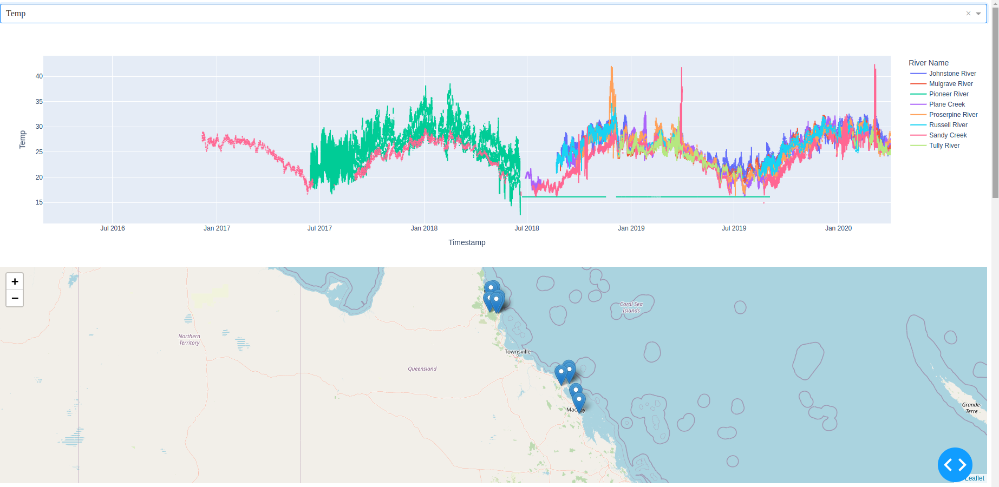
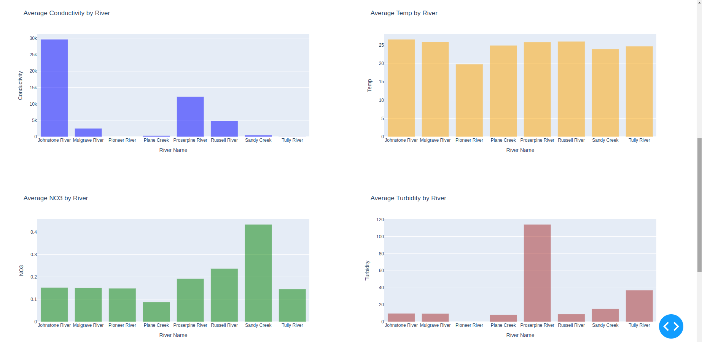
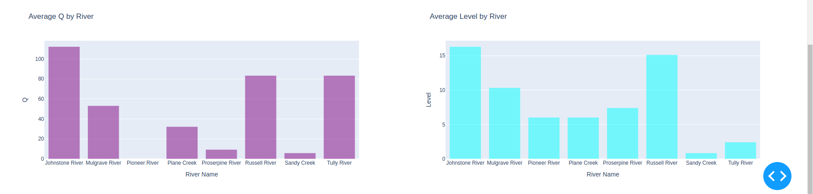

# Water Quality Data Analysis Project

This project uses real-time data collected from various in-situ water quality monitoring stations in North Queensland, Australia, to gain insights into water quality indicators over time. The dataset supports tasks such as water quality forecasting, missing data imputation, and outlier detection, making it a valuable tool for environmental, agricultural, and industrial monitoring.

## Dataset Overview

The dataset includes data from 11 monitoring stations across rivers in North Queensland, Australia. Each station measures key water quality parameters such as:
- Water level
- Water temperature
- Electrical conductivity
- Turbidity
- Nitrate concentration
- Water discharge

The dataset is pre-processed to remove outliers and is resampled for consistency. Data collection periods may vary between stations due to different sensor deployment and replacement times.

Data files included:
- `Johnstone_river_coquette_point_joined.csv`
- `Johnstone_river_innisfail_joined.csv`
- `Mulgrave_river_deeral_joined.csv`
- `Pioneer_Dumbleton_joined.csv`
- `Plane_ck_sucrogen_joined.csv`
- `Proserpine_river_glen_isla_joined.csv`
- `Tully_River_Tully_Gorge_National_Park_joined.csv`
- `Tully_river_euramo_joined.csv`
- `russell_river_east_russell_joined.csv`
- `sandy_ck_homebush_joined.csv`
- `sandy_ck_sorbellos_road_joined.csv`

## Project Structure

- **initial.py**: A script to initially load and visualize each dataset, providing summaries on column types, missing data, and statistical information for numeric columns.
- **agregate_rivers.py**: Aggregates data from individual rivers into a single `aggregated_river_data.csv` file, preserving information on river names and locations.
- **app.py**: Implements a data visualization dashboard using Dash and Dash Leaflet, allowing users to interactively explore water quality data. Key features include:
  - A dropdown menu to select specific metrics for time-series visualization.
  - Interactive maps with markers for each river station.
  - Individual bar charts showing average water quality metrics by river station.

## Data Processing Workflow

1. **Initial Data Exploration** (`initial.py`):
   - Loads and provides a summary for each dataset file.
   - Displays key statistics and identifies any missing values or outliers.

2. **Data Aggregation** (`agregate_rivers.py`):
   - Aggregates data across river stations into a unified format.
   - Aligns columns across files and adds metadata columns for each river’s name and location.

3. **Data Visualization** (`app.py`):
   - Displays time-series plots for selected water quality metrics.
   - Provides a map view with each river station’s geographical location.
   - Offers bar charts summarizing average metrics (Conductivity, Temperature, Nitrate, Turbidity, Discharge, Water Level) for each station.

## Running the Application

To start the data visualization app, run the following command in the terminal:

```bash
python app.py
```
## Dependencies

Make sure to have all dependencies installed, such as:

- `pandas`
- `dash`
- `dash_leaflet`
- `plotly`

You can install them using pip:

```bash
pip install pandas dash dash-leaflet plotly
```


# Step 1: Understanding the Files
In the first step, we need to analyze the dataset files to check their consistency, column structure, and how well the data fits together. The goal here is to identify how many rows are in each file, check if there are any missing values, and verify the columns that exist in each file.
### Loading the Files:
```bash
import pandas as pd
import os

# Directory containing river data files
data_dir = "/home/human/git_data/data/rivers"
```
In this part of the script, we import the necessary pandas library, which will be used for data manipulation, and the os library to handle file paths.
We define the directory (data_dir) where all the river data files are stored. This allows us to point the script to the correct location where our data files are stored.
### Listing the Files:
```bash
# List of river data files
river_files = [
    "Johnstone_river_coquette_point_joined.csv",
    "Johnstone_river_innisfail_joined.csv",
    "Mulgrave_river_deeral_joined.csv",
    "Pioneer_Dumbleton_joined.csv",
    "Plane_ck_sucrogen_joined.csv",
    "Proserpine_river_glen_isla_joined.csv",
    "russell_river_east_russell_joined.csv",
    "sandy_ck_homebush_joined.csv",
    "sandy_ck_sorbellos_road_joined.csv",
    "Tully_river_euramo_joined.csv",
    "Tully_River_Tully_Gorge_National_Park_joined.csv"
]
```
Here, we define the river_files list, which contains the names of all the CSV files to be processed. Each file corresponds to a river monitoring station, with the data for various water quality parameters.
## Step 2: Reading Each File and Inspecting Data
For each file, we will read the contents into a pandas DataFrame and examine the basic structure of the data.
### Looping through Files and Reading Data:
```bash
# Process each file
for file_name in river_files:
    file_path = os.path.join(data_dir, file_name)
    print(f"Processing {file_name}...")
    
    # Read the CSV file into a DataFrame
    df = pd.read_csv(file_path)
```
Here, we loop through the river_files list. For each file, we construct the full file path using os.path.join() to ensure compatibility across different operating systems.
Next, the pd.read_csv() function is used to load each CSV file into a pandas DataFrame, which allows us to interact with the data more easily.
### Basic Summary and Initial Checks:
```bash
    # Print basic information
    print(f"--- Summary for {file_name} ---")
    print("Basic Information:")
    print(f"Columns: {df.columns}")
    print(f"Data Types:\n{df.dtypes}")
```
Here, we print basic information about the dataset:
    • Columns: The names of the columns in the dataset.
    • Data Types: The data types of each column (e.g., integer, float, datetime, etc.).
### Displaying the First Few Rows:
```bash
    # Display the first few rows of the dataset
    print("\nFirst few rows:")
    print(df.head())
```
Using df.head(), we display the first few rows of the dataset to get an idea of the structure and the values contained within each column. This helps us verify if the data looks as expected, especially for the first few entries.
### Checking Missing Data:
```bash
    # Print missing data summary
    print("\nMissing Data:")
    print(df.isnull().sum())
```
Here, we use df.isnull().sum() to check for missing data in the dataset. This method will give us a summary of the number of missing values in each column. If any columns have a significant amount of missing data, it might indicate data quality issues.
### Statistical Summary:
```bash
    # Print statistical summary for numeric columns
    print("\nStatistical Summary (for numeric columns):")
    print(df.describe())
    
    print("\n" + "="*50 + "\n")
```
The df.describe() function is used to generate a statistical summary of the numeric columns, which includes metrics like the mean, standard deviation, minimum, and maximum values. This helps identify outliers or unusual data points.

## Step 3: Output
Each file is processed in turn, and a summary of its basic structure, missing values, and statistical overview is printed. This initial inspection helps determine:
    • The quality of the data (e.g., missing or incomplete records).
    • The presence of any unexpected columns or data types.
    • A sense of the distribution of values (e.g., extremely high or low values, which might indicate outliers).
This is a part of the output – one river
```bash
Processing Tully_River_Tully_Gorge_National_Park_joined.csv...
--- Summary for Tully_River_Tully_Gorge_National_Park_joined.csv ---
Basic Information:
Columns: Index(['Timestamp', 'NO3', 'Level', 'Dayofweek', 'Month'], dtype='object')
Data Types:
Timestamp     object
NO3          float64
Level        float64
Dayofweek      int64
Month          int64
dtype: object

First few rows:
             Timestamp    NO3  Level  Dayofweek  Month
0  2019-03-27T16:00:00  0.015  3.502          2      3
1  2019-03-27T17:00:00    NaN  3.496          2      3
2  2019-03-27T18:00:00    NaN  3.495          2      3
3  2019-03-27T19:00:00    NaN  3.496          2      3
4  2019-03-27T20:00:00  0.016  3.489          2      3

Missing Data:
Timestamp        0
NO3          26412
Level           25
Dayofweek        0
Month            0
dtype: int64

Statistical Summary (for numeric columns):
               NO3         Level     Dayofweek         Month
count  2028.000000  28415.000000  28440.000000  28440.000000
mean      0.013964      2.443103      2.996906      6.184810
std       0.013730      1.176083      1.999962      3.529149
min       0.001000      1.130400      0.000000      1.000000
25%       0.003000      1.625083      1.000000      3.000000
50%       0.010000      2.139000      3.000000      6.000000
75%       0.020000      2.850000      5.000000      9.000000
max       0.092000      8.884375      6.000000     12.000000

==================================================
```

## Summary
The initial.py script serves as the first step in exploring and preparing the data. By loading the dataset files, inspecting the structure, checking for missing data, and calculating basic statistics, it gives you a clear picture of the dataset's state. Based on this output, you can make informed decisions about how to proceed with data cleaning and aggregation.

# Aggregating the data
## 1. Set Up the Data Directory and Output File
The script starts by defining the directory containing the river data files (data_dir) and the output file where the aggregated data will be saved (output_file).
```bash
# Directory containing river data files
data_dir = "/home/human/git_data/data/rivers"

# Output file
output_file = "/home/human/git_data/data/processed/aggregated_river_data.csv"
```
## 2. Define Mapping of River Files
We define a dictionary called river_info, which maps the file names to the river names and locations. This helps associate each data file with specific river locations and allows us to track which river and location each data file belongs to.
```bash
# Mapping of file names to river name and location
river_info = {
    "Johnstone_river_coquette_point_joined.csv": ("Johnstone River", "Coquette Point"),
    "Johnstone_river_innisfail_joined.csv": ("Johnstone River", "Innisfail"),
    "Mulgrave_river_deeral_joined.csv": ("Mulgrave River", "Deeral"),
    "Pioneer_Dumbleton_joined.csv": ("Pioneer River", "Dumbleton"),
    "Plane_ck_sucrogen_joined.csv": ("Plane Creek", "Sucrogen"),
    "Proserpine_river_glen_isla_joined.csv": ("Proserpine River", "Glen Isla"),
    "russell_river_east_russell_joined.csv": ("Russell River", "East Russell"),
    "sandy_ck_homebush_joined.csv": ("Sandy Creek", "Homebush"),
    "sandy_ck_sorbellos_road_joined.csv": ("Sandy Creek", "Sorbellos Road"),
    "Tully_river_euramo_joined.csv": ("Tully River", "Euramo"),
    "Tully_River_Tully_Gorge_National_Park_joined.csv": ("Tully River", "Tully Gorge National Park")
}
```
## 3. Prepare the List of DataFrames
Next, we initialize an empty list dataframes that will hold the individual DataFrames corresponding to each river data file. Each DataFrame will be processed, aligned to a target format, and then added to this list.
```bash
# List to store dataframes
dataframes = []
```
## 4. Define the Final Target Column Order
We specify the target column order target_columns for the aggregated DataFrame. This ensures that regardless of the original order of the columns in the source data, the final DataFrame will have a consistent structure.
```bash
# Define the final target column order
target_columns = ['Timestamp', 'Conductivity', 'NO3', 'Temp', 'Turbidity', 'Dayofweek', 'Month', 'Q', 'Level', 'River Name', 'Location']
```
## 5. Processing Each River File
The script then enters a loop that processes each river data file in the river_info dictionary. For each file, it:
    1. Reads the CSV file into a DataFrame using pd.read_csv().
    2. Adds the river-specific information (i.e., river name and location) as new columns.
    3. Creates an empty DataFrame aligned_df with the target columns, ensuring all columns in the original data are matched to the target column order.
    4. Copies relevant data from the original DataFrame into the aligned DataFrame.
    5. Appends the aligned DataFrame to the dataframes list.
```bash
# Process each file
for file_name, (river_name, location) in river_info.items():
    file_path = os.path.join(data_dir, file_name)
    df = pd.read_csv(file_path)
    
    # Add river-specific information
    df["River Name"] = river_name
    df["Location"] = location
    
    # Initialize an empty DataFrame with the target columns
    aligned_df = pd.DataFrame(columns=target_columns)
    
    # Copy data from the current file's DataFrame to the aligned DataFrame
    for column in df.columns:
        if column in target_columns:
            aligned_df[column] = df[column]
    
    # Fill missing columns with NaN (for columns not present in the file)
    aligned_df["River Name"] = river_name
    aligned_df["Location"] = location
    
    # Append to the list of dataframes
    dataframes.append(aligned_df)
```
## 6. Concatenate All DataFrames
After processing each individual file and storing the aligned DataFrames, the script concatenates all DataFrames from the dataframes list into a single DataFrame using pd.concat(). This step aggregates the data from all rivers into one DataFrame.
```bash
# Concatenate all dataframes
aggregated_df = pd.concat(dataframes, ignore_index=True)
```
## 7. Save the Aggregated Data to CSV
Finally, the script saves the aggregated DataFrame into a CSV file specified by output_file. This file will contain all the data from all the rivers, aligned and ready for further analysis.
```bash
# Save to CSV
aggregated_df.to_csv(output_file, index=False)

print(f"Aggregated data saved to {output_file}")
```
# Visualizing the data
## 1. Import Required Libraries
We begin by importing all the necessary libraries for the Dash application, including Dash, Plotly, and Pandas for data manipulation. We also need Dash's components for building the layout of the app.
```bash
import dash
from dash import dcc, html
import plotly.express as px
import pandas as pd
import os
```
## 2. Initialize the Dash App
Next, we initialize the Dash application. Dash is a framework for building interactive web applications using Python, and it's used here to create a user-friendly interface for exploring river data.
```bash
# Initialize Dash app
app = dash.Dash(__name__)
```
## 3. Load the Aggregated Data
We load the pre-aggregated river data from the CSV file generated earlier by the aggregate_rivers.py script. This DataFrame will be used to populate the visualizations in the app.
```bash
# Path to the aggregated river data CSV file
aggregated_data_file = "/home/human/git_data/data/processed/aggregated_river_data.csv"

# Load the aggregated data into a DataFrame
df = pd.read_csv(aggregated_data_file)
```
## 4. Create Plots for Data Visualization
For the visualization, we can use Plotly to create various charts such as time series plots, scatter plots, and histograms. The following code creates a time series plot for turbidity across all rivers.
```bash
# Create a time series plot for turbidity
turbidity_fig = px.line(df, x='Timestamp', y='Turbidity', color='River Name', title="Turbidity over Time by River")
```
This creates a line plot where the x-axis represents the timestamp, the y-axis represents the turbidity levels, and the color differentiates the rivers.
We can similarly create other plots based on the available metrics like Conductivity, NO3, Temp, Q (discharge), and Level:
```bash
# Create a time series plot for conductivity
conductivity_fig = px.line(df, x='Timestamp', y='Conductivity', color='River Name', title="Conductivity over Time by River")

# Create a time series plot for NO3 (Nitrate) levels
nitrate_fig = px.line(df, x='Timestamp', y='NO3', color='River Name', title="Nitrate (NO3) Levels over Time by River")
```
## 5. Define the Layout of the Dash App
The layout of the app is defined using Dash's HTML components (html.Div, html.H1, html.Div, etc.). We create a basic layout that includes a header, a description of the app, and a few interactive elements like dropdowns or checkboxes if needed.
```bash
# Define the layout of the Dash app
app.layout = html.Div([
    html.H1("River Water Quality Monitoring Dashboard"),
    html.P("This dashboard displays various water quality parameters for multiple rivers based on IoT sensor data."),
    
    # Time series plots
    html.Div([
        dcc.Graph(id='turbidity-plot', figure=turbidity_fig),
        dcc.Graph(id='conductivity-plot', figure=conductivity_fig),
        dcc.Graph(id='nitrate-plot', figure=nitrate_fig)
    ])
])
```
In this example, we create three graphs that display the time series for turbidity, conductivity, and nitrate levels. These plots will be rendered inside the app when the user accesses it.
## 6. Add Interactivity (Optional)
For additional interactivity, we can add dropdowns or sliders that allow the user to filter the data by river or time period. Here's an example of how we could add a dropdown menu to filter the data by river:
```bash
# Create a dropdown for selecting rivers
river_dropdown = dcc.Dropdown(
    id='river-dropdown',
    options=[{'label': river, 'value': river} for river in df['River Name'].unique()],
    value=df['River Name'].unique()[0],  # Default value
    multi=True
)
```
We would then need to modify the plots to respond to the selected river(s) by updating the figures based on the dropdown value.
## 7. Update Graphs Based on User Input
Dash apps are interactive, meaning we can use callbacks to update the content of the app dynamically based on user input. Here's an example of a callback function that updates the turbidity plot based on the selected river(s) from the dropdown:
```bash
from dash.dependencies import Input, Output

# Callback to update the turbidity plot based on selected rivers
@app.callback(
    Output('turbidity-plot', 'figure'),
    [Input('river-dropdown', 'value')]
)
def update_turbidity_plot(selected_rivers):
    filtered_df = df[df['River Name'].isin(selected_rivers)]
    fig = px.line(filtered_df, x='Timestamp', y='Turbidity', color='River Name', title="Turbidity over Time by River")
    return fig
```
This callback function takes the selected rivers as input and filters the data accordingly, then updates the turbidity plot with the filtered data.
## 8. Run the Dash App
Finally, we run the Dash app. This will start a local web server that can be accessed through a browser at the specified address.
```bash
# Run the Dash app
if __name__ == '__main__':
    app.run_server(debug=True)
```
This will start the app in "debug" mode, so any changes to the code will automatically reload the app in the browser.

You will get CLI output like this:
```bash
human@human-ProBook:~/git_data$ python3 app.py 
Dash is running on http://127.0.0.1:8050/

 * Serving Flask app 'app'
* Debug mode: on
```

Then, by opening a web browser and going to 127.0.0.1:8050, you will see the interactive dashboard with all the values represented clearly and easy to compare.






## Acknowledgements

This dataset was sourced from the study by Zhang et al. (2019) on water quality monitoring using IoT networks. For further details on data collection and methodology, see the following publication:

- Zhang, Y. F., Thorburn, P. J., Xiang, W., & Fitch, P. (2019). SSIM—A deep learning approach for recovering missing time series sensor data. *IEEE Internet of Things Journal, 6*(4), 6618-6628.
